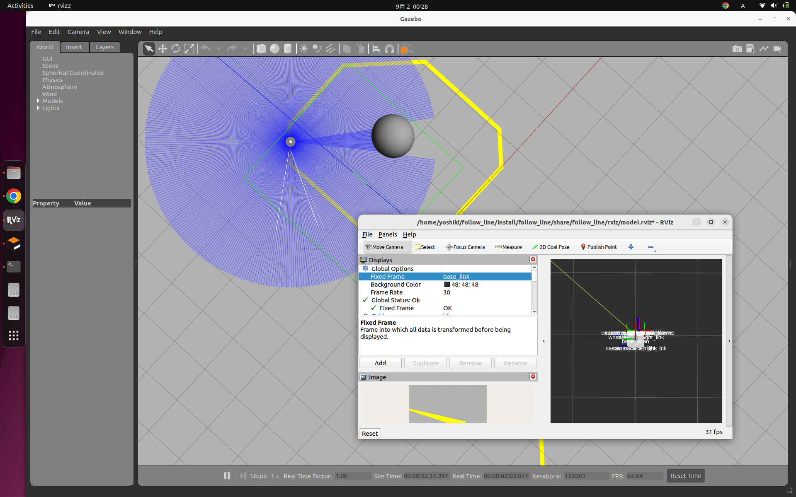

# Line Follower TurtleBot

## Overview

Line following TurtleBot in ROS2, forked from [line\_follower\_turtlebot](https://github.com/sudrag/line_follower_turtlebot)



## Run

```
ros2 launch follow_line display.launch.py
cd src
python detect.py
python motion_node.py
```
